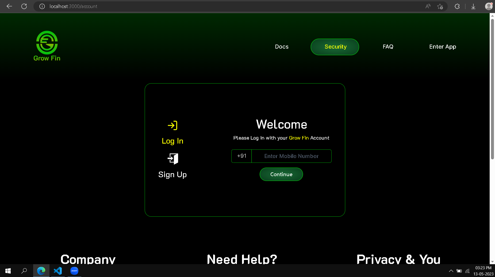
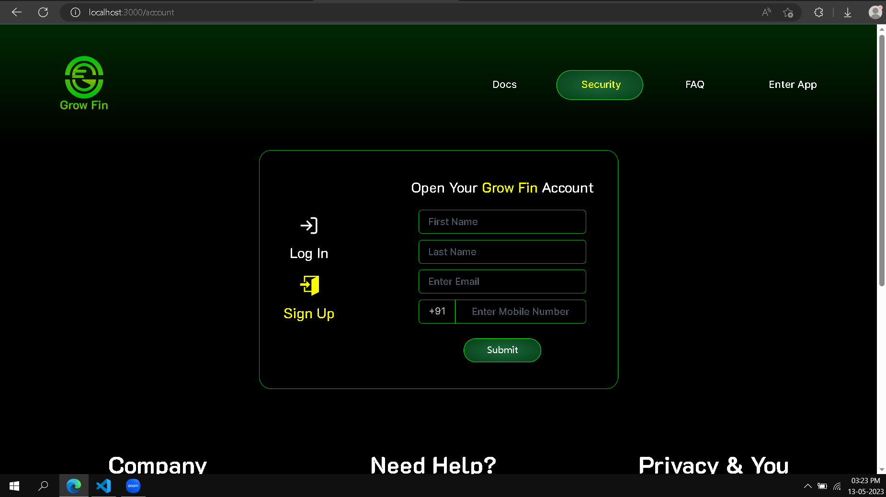
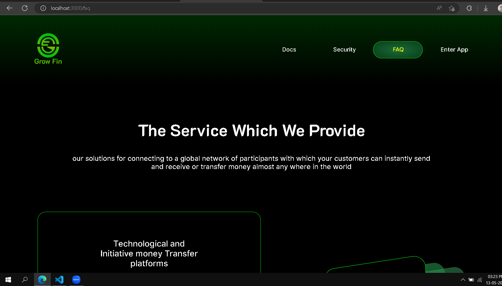
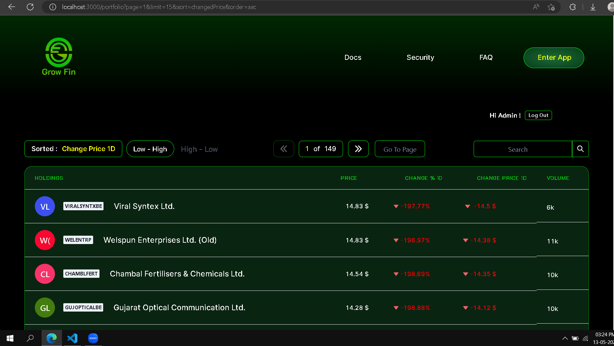
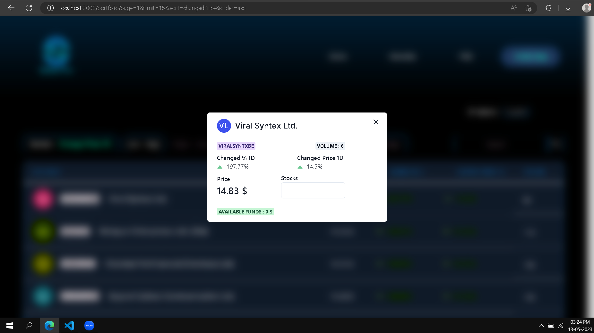
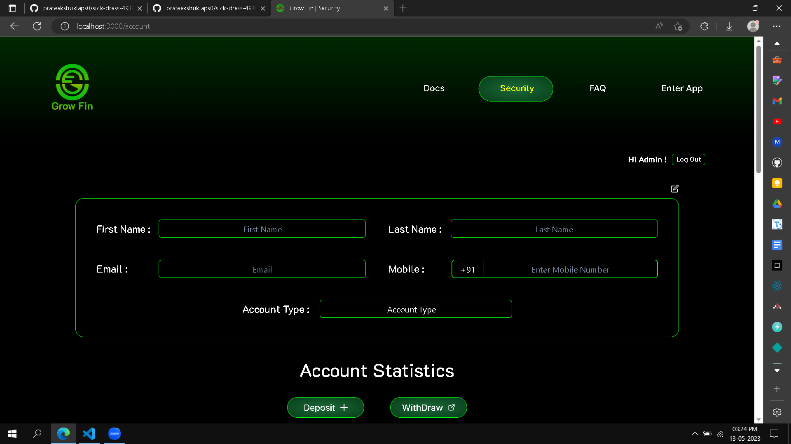
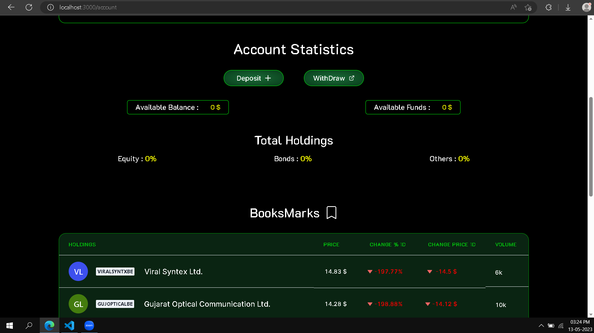

# Grow Fin

# What is Grow Fin about?

Grow Fin is online brokerage website which provide users to manage their financial portfolio such as Stocks, Bonds, Mutual Funds etc.
This Project is build with React and Chakra UI library and JSON-server for backend network requests.

Deployed Link - https://sick-dress-4939.netlify.app/

## Features:-

- Users an Register or Create new Account.
- Users can LogIn with Mobile and OTP.
- Deposit and Withdraw Funds.
- Can visit Stocks page.
- Can BookMark Stocks
- Can Filter Stocks on the basis of Price, Price Changed in 1 Day, Price % Changed in 1 Day, Volume.
- Can Sort Stocks from Low to High and High to Low.
- Can search among 2230 Stock Lists.
- Can Redirect to any page.
- Can Invest in Stocks and track the funds in account section.

## Areas Under Development:-

- User Account Edit Functionality.
- Add Product Results for Bonds and Mutual Funds.
- Intigrate Process for Authentic Verification and Connectivity of Bank.
- Track Record PAge for invested Stocks.

## Tech Stacks Used:-

React / Chakra UI / React Icons / Framer Motion / Ant Design / Chakra UI Icons / BootsStrap / Material UI / Axios / React Router Dom

## How to Run:-

- Open Terminal and run - npm run install
- Open another Terminal - npm run start (to start the local backend server)

